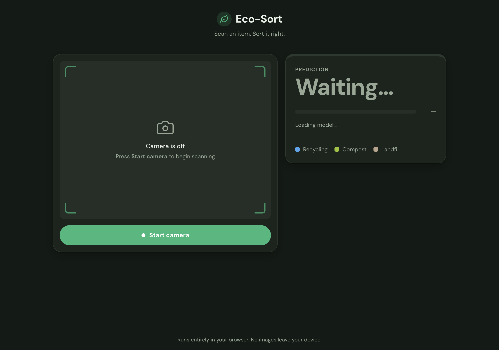
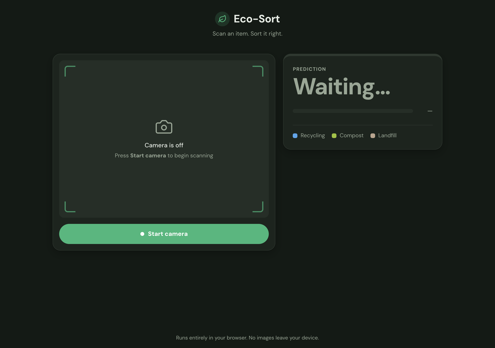
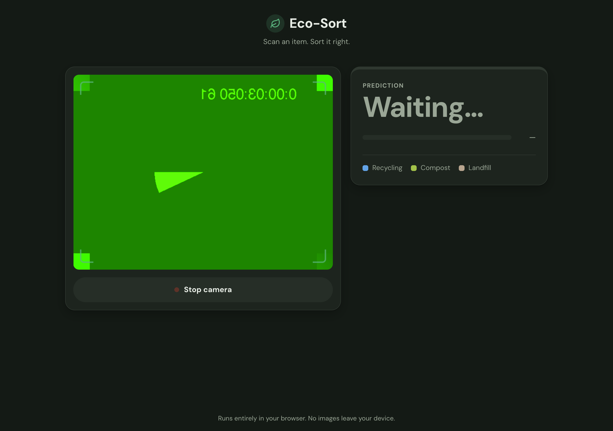
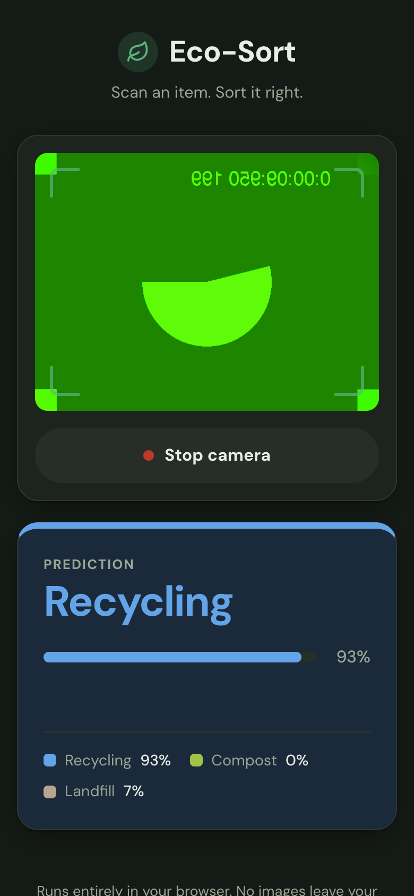
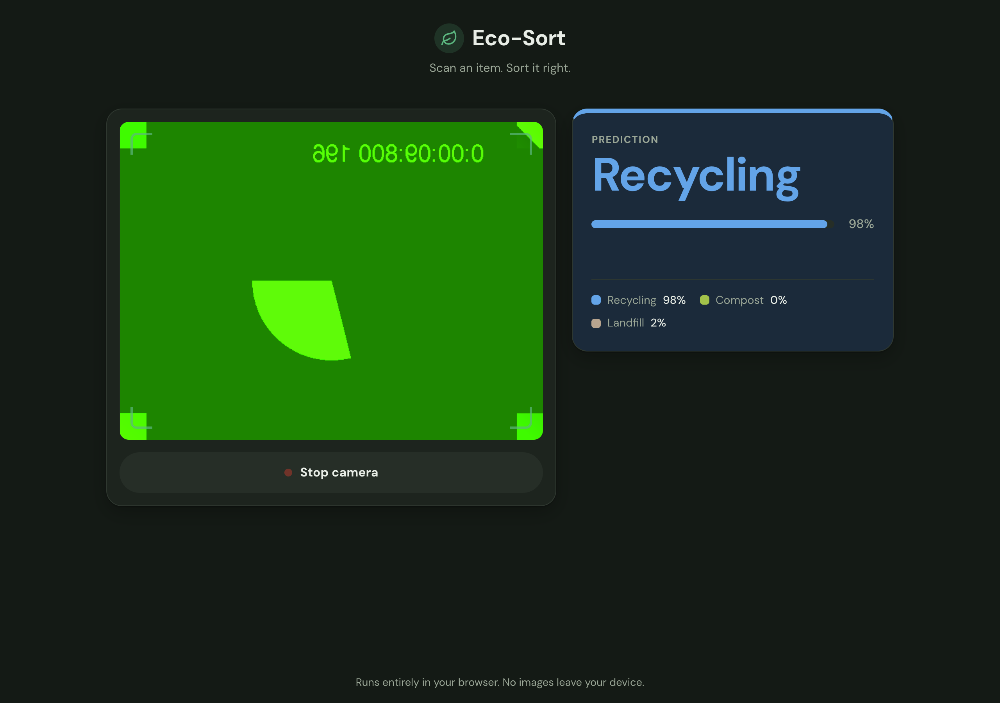

**[Try the finished app →](https://karanamtej1-lab.github.io/eco-sort/)** It
works on a phone or a laptop with a camera. Source is on
[GitHub](https://github.com/karanamtej1-lab/eco-sort).

## Overview

Standing over three bins with a coffee cup in your hand, you usually guess.
Eco-Sort removes the guess. Hold the item up to your camera and it names the
bin: **Recycling**, **Compost**, or **Landfill**, with a confidence bar and a
percentage for every class.

Everything runs on your own device. The model downloads once, then every
prediction happens inside the browser. No image is ever uploaded anywhere.

## The goals I set

1. **No install.** A web page, not an app store download.
2. **No server.** Plain HTML, CSS, and JavaScript on GitHub Pages. Nothing to
   host, nothing to pay for, nothing that can go down.
3. **Private.** Camera frames never leave the device.
4. **Honest.** If the model isn't sure, the app says so instead of guessing.

## How I built it

I split the build into three phases. Each phase ended with something working
that I could commit, and each one only added JavaScript on top of hooks the
previous phase left behind.

### Phase 1: the UI shell (HTML and CSS only)

Before touching the camera or the model, I built the whole page as static
HTML and CSS: the camera frame, the Start button, and the prediction card with
its legend.

The key decision here was that the result card's color is driven by a single
`data-state` attribute. Setting it to `recycling`, `compost`, `landfill`,
`uncertain`, or `idle` swaps the colors through CSS. That meant Phase 3 would
never have to touch styling. It only has to set one attribute.

I also set up a local static server during this phase, because browsers only
allow camera access over HTTPS or on `localhost`. Opening the file directly
from disk would have blocked the camera.

### Phase 2: the camera

Next, `app.js` took over the camera lifecycle: request access, play the stream
in the `<video>` element, and toggle Start/Stop.

This screenshot is Phase 2 running in Chrome with its fake test camera. The
camera works, but the prediction card still says "Waiting…" because there is
no model yet.

Things I handled in this phase:

- **Rear camera first.** On a phone you point the camera at trash, not your
  face, so it asks for `facingMode: "environment"`. Laptops with only a front
  camera fall back to it automatically.
- **Mirroring.** Only the front camera is mirrored. Mirroring the rear camera
  would make text on packaging read backwards.
- **Every failure gets a plain message.** Camera blocked, no camera found,
  camera busy in another app, page not on HTTPS. Each one shows a specific
  sentence telling you what to do, not a generic error.
- **Events, not coupling.** When the camera starts or stops, `app.js` fires a
  `camera:started` or `camera:stopped` event on the page. The classifier
  listens for those events. Neither file reaches into the other, so I could
  build and test the camera without the model existing yet.

### Phase 3: the model

I trained the image classifier in **Google Teachable Machine** with three
classes (Recycling, Compost, Landfill) and exported it for TensorFlow.js.
`classifier.js` loads it from Teachable Machine's hosting and runs it on the
live camera feed.

The model gives a probability for each class on every frame. Showing that raw
number flickered badly, so most of this phase went into making the output
steady and trustworthy:

- **Warm-up pass.** The first prediction compiles WebGL shaders and takes
  about a second. The app runs one throwaway prediction on a blank 224×224
  canvas right after loading, so the first real frame is instant.
- **8 predictions a second, not 60.** A label can't change faster than a
  person can read it. Running every frame would just drain the battery. The
  loop also subtracts how long the last prediction took, so it holds a steady
  rate on slow phones.
- **Smoothing.** Each new frame is blended into a running average
  (exponential moving average, weight 0.35). One odd frame can't flip the
  label, and it still settles in about half a second when you swap items.
- **A confidence floor.** Below 60% the card says **"Not sure"** and tells you
  to hold the item closer, centered, in good light.
- **Stop means stop.** If you stop the camera while a prediction is running,
  the loop checks for that and exits instead of scheduling another frame.

## What broke, and what I learned

The most useful screenshot I took while documenting this project is the one
below, and it shows the model being **wrong**.

That's Chrome's fake test camera: a green screen with a spinning shape. There
is no trash in it. The model calls it Recycling at 98%.

The reason is that the model only knows three answers. It was never trained
on "nothing" or "not trash," so for *anything* it sees, it has to pick one of
the three bins, and it can be very confident about it. My 60% confidence floor
catches blurry and ambiguous frames, but it cannot catch an image the model is
confidently wrong about.

What I took from it:

- **Confidence is not correctness.** A high percentage only means the model
  prefers one of the options it knows. It says nothing about whether the
  input looks like anything it was trained on.
- **The fix is in the data, not the code.** The real fix is a fourth
  "Nothing / background" class trained on empty scenes. I already prepared the
  code for it: any class that isn't a bin keeps the card neutral and shows
  "No item" instead of coloring it green.
- **Building in phases paid off.** Because the camera and the model only talk
  through two events, I could test the camera alone in Phase 2, and swapping
  in a retrained model later is a one-line URL change.

## Status

Live at
**[karanamtej1-lab.github.io/eco-sort](https://karanamtej1-lab.github.io/eco-sort/)**.
Next step: retrain with a background class and more photos of each bin's
common items.
