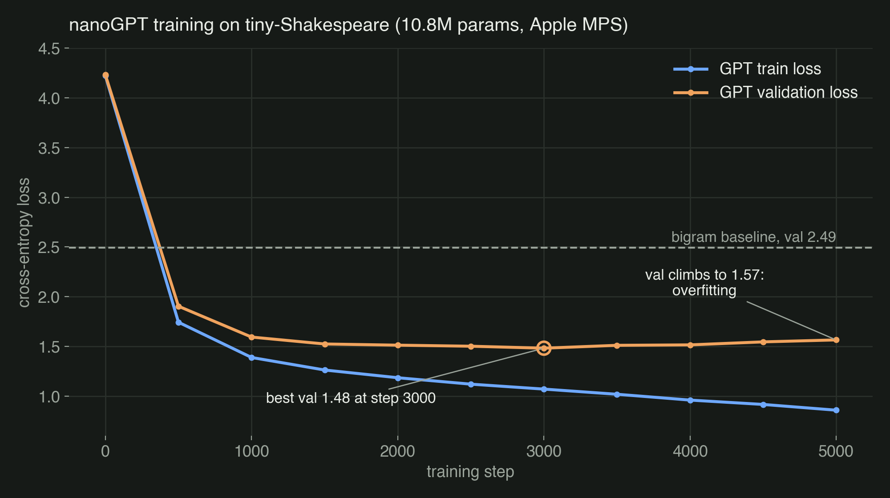

**[See the finished code on GitHub →](https://github.com/karanamtej1-lab/nanogpt)**
Clone it, run `python gpt.py`, and it trains and writes its own Shakespeare.

 and the finished GPT (right)")

## Overview

A GPT built from nothing but tensors. It reads all of Shakespeare one
character at a time, learns the patterns, and writes new lines that look like
the real thing. No library does the hard part. Every piece of the Transformer
is written out by hand in about 200 lines of PyTorch.

I built it by following Andrej Karpathy's
["Let's build GPT: from scratch, in code, spelled out."](https://www.youtube.com/watch?v=kCc8FmEb1nY)
I typed every line myself and mapped each idea in the video to where it lives
in the code.

## How I built it

### Step 1: turn text into numbers

The dataset is tiny-Shakespeare: about 1.1 MB of plays, with 65 unique
characters. Each character gets an integer ID (`stoi`), and a reverse table
(`itos`) turns IDs back into text. That's the whole tokenizer.

I split the data 90/10 into training and validation. The model never trains
on the validation text, so validation loss is the honest score.

### Step 2: the bigram baseline (`bigram.py`)

Before building anything clever, I built the dumbest model that could work: a
lookup table where each character predicts the next one, looking only at the
character right before it.

This step matters more than it looks. It sets up everything the real model
reuses: random batches of text, the cross-entropy loss, the AdamW training
loop, and `generate`, which samples one character at a time.

It trains in about 30 seconds and levels off at a **validation loss of
2.49**. The left side of the picture above is what that looks like: roughly
the right letter frequencies, the right line lengths, and nonsense words.
That's the number the real model has to beat.

### Step 3: self-attention

A bigram model only sees one character back. To write real words, each
character needs to look at *all* the characters before it and decide which
ones matter.

That's self-attention. Each character produces a **query** ("what am I looking
for?"), a **key** ("what do I contain?"), and a **value** ("what I'll pass
along"). A query matched against every key gives a score for each earlier
character. Here is one attention head from my code:

```python
def forward(self, x):
    B, T, C = x.shape
    k = self.key(x)
    q = self.query(x)
    wei = q @ k.transpose(-2, -1) * k.shape[-1] ** -0.5
    wei = wei.masked_fill(self.tril[:T, :T] == 0, float('-inf'))
    wei = F.softmax(wei, dim=-1)
    v = self.value(x)
    return wei @ v
```

The line with `tril` is the causal mask. It blocks every character from
seeing the future, which is what lets the model learn to predict the next
character instead of copying it. The `** -0.5` scaling keeps the scores from
getting so large that softmax collapses onto a single character.

### Step 4: build the Transformer

Then I stacked the pieces:

- **Multi-head attention.** Six heads run in parallel, each 64 wide, so
  each head is free to learn a different pattern in the text.
- **Feed-forward layer.** After attention lets characters talk to each
  other, a small two-layer network lets each one think on its own.
- **Residual connections and LayerNorm.** Each block adds its output back
  onto its input (`x = x + self.sa(self.ln1(x))`). That shortcut is what lets
  gradients flow through six stacked blocks without fading out.
- **Positional embeddings.** Attention on its own has no idea of order, so
  each position gets a learned vector added to it.
- **Dropout (0.2)** to fight overfitting.

The final model is 6 blocks, 6 heads, 384-dimensional embeddings, and a
256-character context window: **10.79 million parameters**.

### Step 5: train it

I trained it for 5,000 steps on my Mac's GPU through Apple's MPS backend. The
code picks CUDA, then MPS, then CPU automatically. Every 500 steps it
measures the average loss on both training and validation data.



## What the numbers taught me

- **The Transformer crushed the baseline.** Validation loss went from 2.49
  (bigram) to **1.48**. The right side of the sample image shows the
  difference: real words, character names in the right format, line breaks
  where a play would put them, and even Juliet showing up in a sentence.
- **It overfit, and the log proves it.** Validation loss hit its best, 1.48,
  at step 3,000. After that, training loss kept falling (down to 0.86), but
  validation loss rose back to **1.57**. The model had started memorizing the
  training text instead of learning patterns that transfer. The sample above
  comes from the final step-5000 model, so it's slightly worse than the best
  checkpoint would have been.
- **The fix is early stopping.** I should save the model whenever
  validation loss hits a new low and keep that checkpoint, not the last one.
  That's the first thing I'd change.
- **Attention is a weighted average with learned weights.** The math that
  looked scary is a matrix multiply, a mask, and a softmax. Writing it by hand
  instead of importing it is the difference between using a Transformer and
  understanding one.

## Status

Built and trained. Next: early stopping to keep the best checkpoint, then
moving from characters to word-piece tokens so it can learn longer-range
structure.
